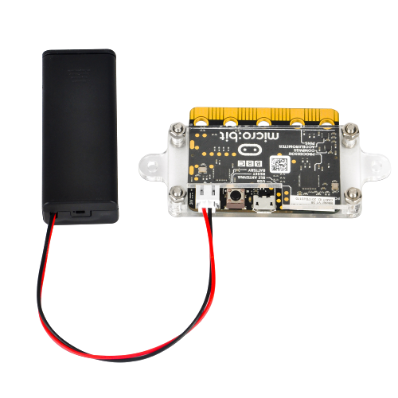

# MicroBit

___Description___

This web application is build for collecting data from BBC microbit sensors and displaying room temperature, light levels during day/night and store all incoming information from the sensors in the database overtime.

 ___Web application functionalities___
* A database to store the data
* Possibility to watch the data collection in a terminal as it collects live.
* Web Application with minimalistic design to make it as clear as possible for the eyes of the user.
* Show the stored information with the help of a web application.
* Measure temperature/light level during the day.
* Show the highest and lowest value of the temperature/light during the day.
* Possible to add as many number of micro bits and rooms as user likes.
* Color coded values.
* Login function to show the history of the measurements and only accessible through admin.
* Only admin able to add sensor/s.

## Guide for installation
###### Web browsers
You can use any common browser(not internet Explorer).
###### Terminal
A terminal is also needed. You can use e.g cygwin or powershell.
###### Npm & Node.js
Project Microbit is built with npm and Node.js, type "npm install" to get all the used dependencies in this project.
###### Python and PIP
The script is in python so python must be installed on your system. Pip is also used and the dependencies choosen are Serial, MicroPython and MYSQL-connector.
###### MySql
Database is created with Mysql and to create the database there is a bash script(sql/reset.bash) that can be run in a terminal to setup the database.

## Guide for running the program
###### Step1: Setup the database
Setup the database with bash.reset or setup.sql and after ddl.sql
###### Step2: Transfer code to sensors
The python script can be uploaded to the sensors by using an online pythoneditor e.g https://python.microbit.org/v/1.1
Transfer LoadReceiver.py to a sensor that you want it to be a reciever(R) to recieve data from other microbits.
Transfer LoadSender.py to your other microbit/s. Give each microbit a unique id and specify number of seconds between each reading.
###### Step3: Connecting the microbits
Connect the reciever microbit with usb to pc and it should indicate/display "R". Connect the other microbits to a battery source provided with microbits and they should display their id's.
###### step4: Running the web application
In e.g cygwin or Powershell terminal navigate your way to where the project is located and run "node index.js" to start the server.
###### step5: Open the web application
Start the website by typing http://localhost:1337/sensors/index.
###### step6: log in to register number of microbits
Navigate to "Add sensors" and the desired number of sensors. 
__NOTE: in field sensors id be sure to enter the id that displays on the sensors otherwise the data will be lost and not saved in the database.__

###### step7: Start collecting data
Open a terminal and navigate yourself to the project folder and to start collecting data, just run "python3 connect.py".
###### Step8: See the information
The information can be shown if clicked on sensors names.

---
You can read more about BBC Microbit here [Link](https://microbit.org/)
